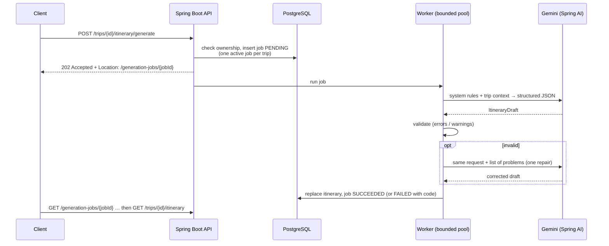
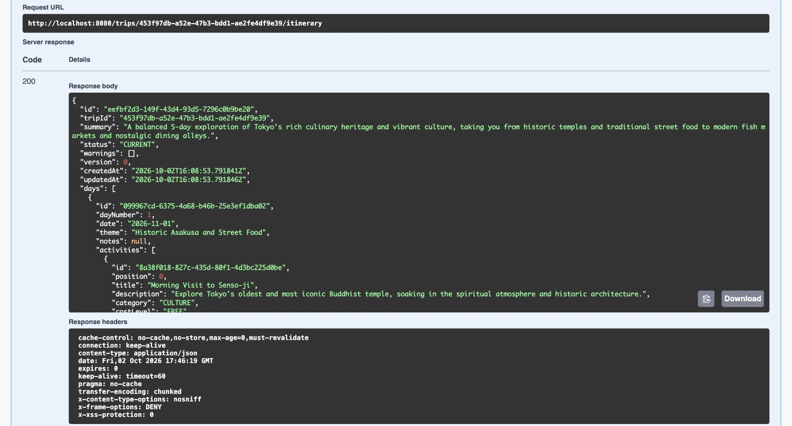
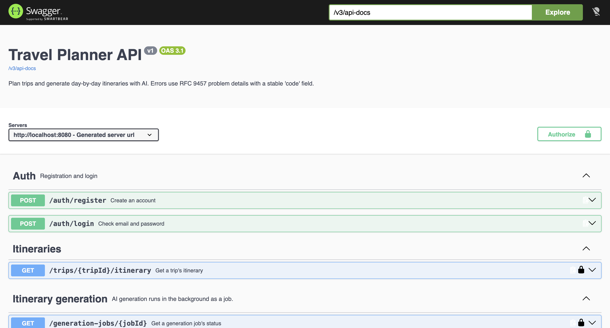

# Travel Planner

[](https://github.com/sh-toqa/travel-planner/actions/workflows/backend-ci.yml)

A Spring Boot backend that turns trip preferences into a **validated, day-by-day itinerary generated with AI**.
The model is treated like any other unreliable external service: its output is parsed into typed records,
checked against business rules, repaired once if needed, and generated in the background with bounded retries.


## Features

- **Trips** – create, list, update and delete trips (destination, dates, budget level, pace, travel vibes).
  Users only ever see their own trips; anyone else's trip returns `404`.
- **AI itinerary generation** – Gemini (via Spring AI) produces a structured plan: days, timed activities,
  categories, cost levels and real places.
- **Output validation and repair** – generated plans are checked for the right days and dates, valid times,
  ordering and overlaps. Invalid plans get **one** repair attempt with the errors fed back to the model;
  softer issues (e.g. a high-cost activity on a balanced budget) are saved as warnings.
- **Asynchronous jobs** – generation returns `202 Accepted` with a job to poll, runs on a bounded worker pool,
  allows one active generation per trip (enforced by the database), and survives restarts cleanly.
- **Consistent errors** – every error is an RFC 9457 problem detail with a stable `code`.
- **API documentation** – OpenAPI document and Swagger UI generated from the code.

## Tech stack

| Area | Technology |
|---|---|
| Language / framework | Java 21, Spring Boot 4.1 |
| AI | Spring AI 2.0 (`ChatClient`, structured output) with Google Gemini |
| Persistence | PostgreSQL, Spring Data JPA / Hibernate, Flyway migrations |
| Security | Spring Security (HTTP Basic for now, stateless) |
| API docs | springdoc-openapi 3 (Swagger UI) |
| Testing | JUnit 5, MockMvc, Testcontainers (PostgreSQL), Awaitility, a scripted fake AI model |
| Frontend (in progress) | React, Vite, Tailwind CSS |

## How itinerary generation works



Example: a generated 5-day Tokyo itinerary returned by `GET /trips/{id}/itinerary`:


## Design decisions

- **Structured output, not free text.** The model's reply is mapped to Java records (`ItineraryDraft`);
  Spring AI derives a JSON schema from them and sends it with the prompt.
- **Validate before saving.** A pure-Java `ItineraryValidator` checks the draft against the trip, so a bad
  plan never replaces a good one. Errors trigger a single repair call; more retries rarely help and multiply cost.
- **Prompt injection defence.** Fixed rules live in the system message; user-written text is fenced inside
  `<preferences>` tags in the user message, and the model has no tools that could read or change data.
- **Bounded external calls.** The Gemini client has a request timeout and no SDK-level retries, and Spring AI
  retries are limited, so an overloaded provider fails a job within seconds instead of minutes.
- **No message broker.** Jobs are rows in PostgreSQL run by an in-process executor; a partial unique index
  guarantees one active job per trip. Interrupted jobs are marked failed at startup.
- **Ownership in the query.** Trips are only loaded by id *and* owner, so another user's trip is
  indistinguishable from a missing one.
- **Schema owned by Flyway.** Hibernate only validates; constraints such as date ranges, allowed enum values
  and coordinate pairs are enforced in the database too.
- **No N+1.** The itinerary tree is loaded in a constant number of queries (entity graph + batch fetching).

## API overview

Full interactive documentation: `http://localhost:8080/swagger-ui.html`


| Method | Path | Description |
|---|---|---|
| POST | `/auth/register` | Create an account (public) |
| POST | `/auth/login` | Check credentials (public) |
| GET | `/users/me` | Current user |
| POST / GET | `/trips` | Create a trip / list your trips (paged, sortable) |
| GET / PUT / DELETE | `/trips/{id}` | Read, replace (optimistic locking) or delete a trip |
| POST | `/trips/{id}/itinerary/generate` | Start AI generation → `202` + job |
| GET | `/generation-jobs/{jobId}` | Job status: `PENDING`, `RUNNING`, `SUCCEEDED`, `FAILED` |
| GET | `/trips/{id}/itinerary` | The generated itinerary with days, activities and warnings |

## Running locally

**Prerequisites:** Java 21, PostgreSQL, Docker (for tests), a Gemini API key
([Google AI Studio](https://aistudio.google.com); the free tier is enough).

1. Create a database named `travel_planner` and a user that owns it.
2. Set environment variables (never commit the key):
   ```bash
   export DB_USERNAME=your_db_user
   export DB_PASSWORD=your_db_password
   export GEMINI_API_KEY=your_key
   ```
3. Run the backend — Flyway creates the schema on startup:
   ```bash
   cd backend && ./mvnw spring-boot:run
   ```
4. Open `http://localhost:8080/swagger-ui.html`, register a user with `POST /auth/register`,
   then click **Authorize** and log in with HTTP Basic.

## Tests

```bash
cd backend && ./mvnw test
```

Docker must be running. Integration tests start PostgreSQL with Testcontainers (Flyway runs every migration)
and replace Gemini with a scripted fake model, so they need no database setup, no API key and no network.
They cover authentication, trip ownership and versioning, and the full asynchronous generation flow:
success, repair, unrepairable output, provider outage and one active job per trip.

## Project structure

```
backend/src/main/java/dev/toqash/travelplannerbackend/
├── auth/        registration, login
├── user/        user entity, current user, email normalisation
├── trip/        trips: entity, validation, CRUD with ownership
├── itinerary/   itinerary, days and activities; read model
├── planner/     AI generation: prompts, structured output, validator, async jobs
├── common/      shared API types (paging, errors)
└── config/      security, error handling, OpenAPI
backend/src/main/resources/
├── db/migration/   Flyway migrations
└── prompts/        prompt templates
```

## Roadmap

- [ ] JWT access and refresh tokens (replacing HTTP Basic)
- [ ] AI tool calling with a places API for real venues and coordinates
- [ ] Observability: AI latency, token usage and failure metrics
- [ ] Frontend: trips, generation progress and itinerary view
- [ ] Manual itinerary editing (move, reorder, lock activities)